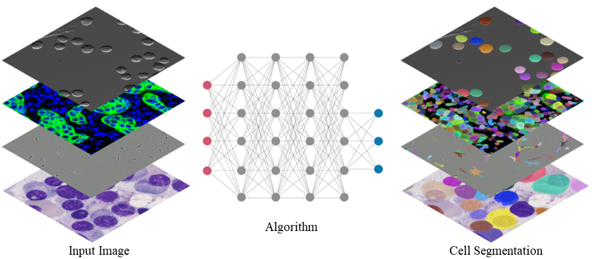

This is `NeurIPS-CellSeg <https://neurips22-cellseg.grand-challenge.org/>`_ documentation!
===================================

NeurIPS-CellSeg is a **Weakly Supervised Cell Segmentation Challenge in Multi-modality High-Resolution Microscopy Images**. 
Cell Segmentation is usually the first step for downstream single-cell analysis in microscopy image-based biology and biomedical research. Deep learning has been widely used for image segmentation, but it is hard to collect a large number of labeled cell images to train models because manually annotating cells is extremely time-consuming and costly. Furthermore, datasets used are often limited to one modality and lacking in diversity, leading to poor generalization of trained models. This competition aims to benchmark cell segmentation methods that could be applied to various microscopy images across multiple imaging platforms and tissue types. We frame the cell segmentation problem as a weakly supervised learning task to encourage models that use limited labeled and many unlabeled images for cell segmentation as unlabeled images are relatively easy to obtain in practice.

This competition has four main features:

.. note::

   This project is under active development.

Contents
--------

.. toctree::

   preprocessing
   training
   inference
   build-docker
